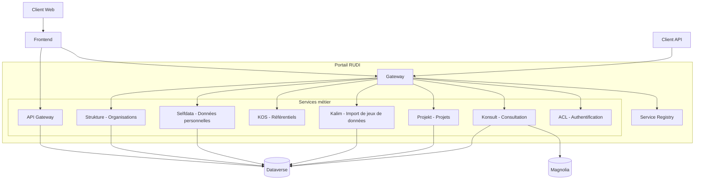

# Architecture globale

## Vue d'ensemble

La plateforme RUDI est construite selon une architecture microservices, permettant une grande modularité, une maintenance facilitée et une scalabilité horizontale. Cette approche permet également de développer, déployer et faire évoluer chaque service indépendamment.

L'architecture de RUDI s'articule autour de cinq composants principaux :

1. [**Le frontend Angular**](./frontend/0-generalites.md) : Interface utilisateur pour le portail grand public
1. [**Les microservices**](./microservices/0-generalites.md) : Services backend autonomes, chacun responsable d'une fonctionnalité métier spécifique
1. [**Les facettes**](./facettes/0-generalites.md) : Bibliothèques de code partagées entre les microservices
1. [**Dataverse**](./dataverse/0-generalites.md) : Solution open source de gestion des jeux de données
1. [**Magnolia**](./magnolia/0-generalites.md) : Solution CMS Headless pour la publication de contenus informatifs

## Architecture globale

## Communication entre services

Les microservices communiquent entre eux de différentes manières:

1. **Communication synchrone**: Appels REST entre services pour les opérations directes
2. **Communication asynchrone**: Messages pour les opérations longues ou les mises à jour en arrière-plan
3. **Partage de code**: Via les facettes pour réutiliser la logique métier

La Gateway centralise les appels clients et les route vers les microservices appropriés, offrant un point d'entrée unique aux API.

