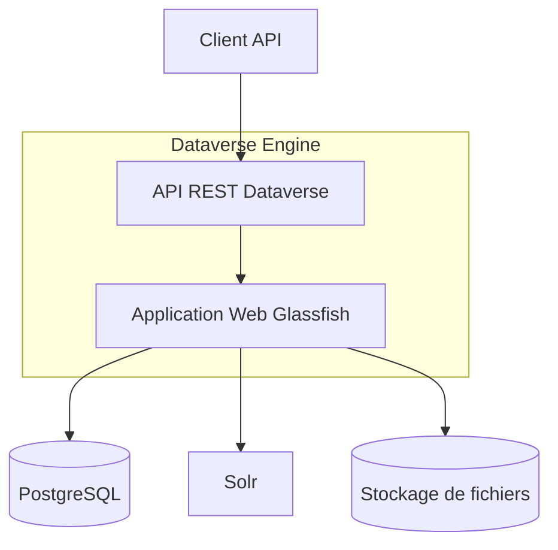

# Dataverse

## Présentation générale

[Dataverse](https://dataverse.org/) est une application open source de gestion, partage et archivage de données développée par l'Université Harvard. 

Dans l'architecture RUDI, Dataverse joue un rôle de catalogue et entrepôt des jeux de données.

## Rôle dans l'architecture RUDI

Dataverse est utilisé par RUDI pour:

1. **Stocker les métadonnées** des jeux de données
2. **Gérer les fichiers** associés aux medias
3. **Fournir un moteur de recherche** pour le catalogue de données

## Architecture de Dataverse

Dataverse est construit sur les technologies suivantes:

- **Java EE**: Langage et plateforme principale
- **[Payara](https://www.payara.fish/)**: Serveur d'application
- **PostgreSQL**: Base de données relationnelle
- **Solr**: Moteur de recherche et d'indexation

## Intégration avec RUDI

L'intégration entre RUDI et Dataverse se fait via plusieurs composants:

1. **Facet KMedia**: Fournit des fonctionnalités liées aux media tels que les logos (ajout, stockage)
1. **Facet KAccess**: Fournit des fonctionnalités liées aux métadonnées des jeux de données (ajout, modification, recherche, consultation, archivage)

Pour plus d'informations, consulter [la page dédiée aux facettes Dataverse](../facettes/facet-dataverse.md).

## Configuration de Dataverse pour RUDI

Les différentes opérations liées à l'installation et la configuration de Dataverse pour RUDI sont détaillées sur la page dédiée à l'[installation de Dataverse](../../demarrage/demarrage-dataverse.md)

### Structure des Dataverses

RUDI utilise plusieurs Dataverses pour organiser les données:
- `rudi`: Dataverse racine
- `rudi_data`: Données actives/publiées
- `rudi_archive`: Données archivées
- `rudi_media_data`: Médias (logos, images, etc.)

## Documentation connexe

- [Dataverse](https://dataverse.org/) - Documentation officielle de Dataverse
- [Facette Dataverse](../facettes/facet-dataverse.md) - Documentation technique de la facette d'intégration
- [Installation de Dataverse](../../demarrage/demarrage-dataverse.md) - Documente l'installation de Dataverse dans le cadre de RUDI
