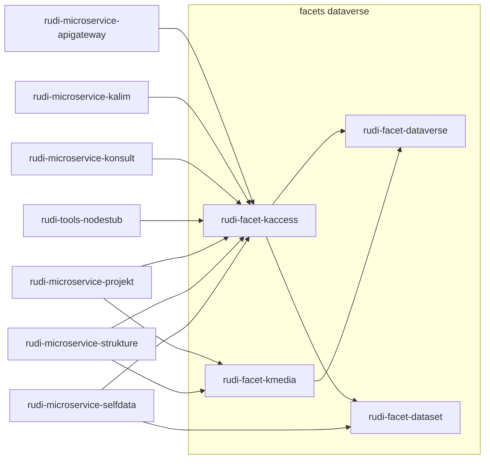

# Facette Dataverse

## Présentation générale

La facette `rudi-facet-dataverse` est un composant clé de l'architecture RUDI, responsable de l'intégration avec l'application Dataverse qui sert de catalogue de données central. Cette facette fournit une couche d'abstraction permettant aux microservices d'interagir avec Dataverse de manière standardisée et simplifiée.

## Fonctionnalités principales

- Connexion à l'API REST de Dataverse
- Gestion des jeux de données (datasets)
- Manipulation des métadonnées
- Recherche et filtrage des données
- Téléchargement et upload de fichiers
- Gestion des permissions et des publications

## Architecture technique

Il existe 4 facettes pour l'accès à Dataverse.

Principalement, les microservices utilisent les 2 facettes suivantes :
1. **Facet KAccess**: Accès aux jeux de données
1. **Facet KMedia**: Accès aux medias

Ces 2 facettes s'appuient sur 2 autres facettes:
1. **Facet Dataverse**: Bibliothèque qui encapsule les appels à l'API dataverse
1. **Facet Dataset**: Bibliothèque de manipulation des informations des jeux de données

Les différents microservices utilisant dataverse sont:



## Intégration avec Dataverse

### Modèle d'authentification

L'authentification avec Dataverse se fait via un token API :

```java
// Configuration de l'authentification
@Value("${dataverse.api.token}")
private String dataverseToken;

// Utilisation dans les requêtes HTTP
HttpHeaders headers = new HttpHeaders();
headers.set("X-Dataverse-key", dataverseToken);
```


## Configuration

### Propriétés de configuration

L'ensemble des microservices utilisant les facettes dataverse doivent disposer des propriétés suivantes :

```properties
# URL de l'API Dataverse
dataverse.host=https://dataverse-host
dataverse.api.url=${dataverse.host}/api

# Token d'authentification
dataverse.api.token=your-api-token

# Alias des dataverses utilisés
dataverse.api.rudi.root.alias=rudi
dataverse.api.rudi.data.alias=rudi_data
dataverse.api.rudi.archive.alias=rudi_archive
```
