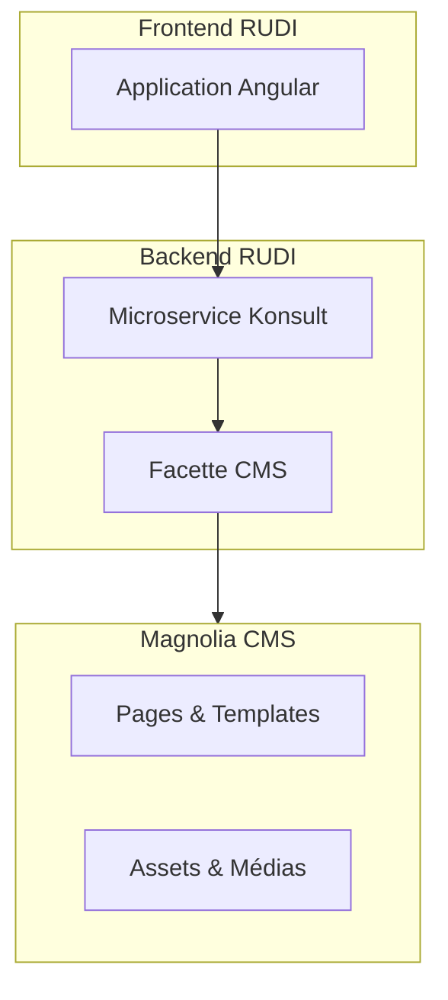

# Magnolia CMS

## Présentation de Magnolia

Magnolia est un système de gestion de contenu (CMS) basé sur Java qui offre une plateforme flexible pour la création, la gestion et la publication de contenu web. Fondé en 2003, Magnolia se distingue par son architecture modulaire, son interface utilisateur intuitive et sa capacité à s'intégrer avec d'autres systèmes et applications.

### Caractéristiques principales

- **Architecture headless** : Magnolia peut fonctionner comme un CMS headless, permettant de gérer le contenu séparément de sa présentation
- **Interface utilisateur intuitive** : L'interface administrateur "Pulse" offre une expérience utilisateur moderne et conviviale
- **Système de workflow personnalisable** : Permet de définir des processus de validation et de publication adaptés aux besoins spécifiques
- **Architecture modulaire** : Basée sur des modules qui peuvent être activés, désactivés ou remplacés selon les besoins
- **API robustes** : REST, GraphQL et autres API facilitant l'intégration avec d'autres systèmes
- **Gestion multi-sites** : Possibilité de gérer plusieurs sites web à partir d'une seule instance
- **Personnalisation avancée** : Développement facile de fonctionnalités sur mesure grâce à son architecture flexible

## Intégration avec RUDI

Dans le cadre du projet RUDI (Rennes Urban Data Interface), Magnolia CMS joue un rôle central pour la gestion des contenus éditoriaux du portail. Son intégration permet de séparer clairement la gestion des données métiers (datasets) de la gestion des contenus web.

### Architecture d'intégration

### Rôle dans RUDI

1. **Gestion des pages éditoriales**
   - Pages d'accueil et sections informatives
   - Articles et actualités
   - Pages de présentation des projets
   - Documentation utilisateur

2. **Intégration technique**
   - Facette CMS (`rudi-facet-cms`) qui encapsule les interactions avec Magnolia
   - API REST pour la récupération des contenus par le frontend

### Avantages de l'utilisation de Magnolia dans RUDI

- **Séparation des préoccupations** : Les experts métier gèrent les données tandis que les éditeurs web gèrent les contenus
- **Flexibilité éditoriale** : Les équipes éditoriales peuvent créer et modifier le contenu sans intervention des développeurs
- **Performance** : La mise en cache intégrée améliore les temps de réponse pour les contenus fréquemment consultés
- **Évolutivité** : Possibilité d'ajouter de nouveaux types de contenus sans modifier l'architecture globale
- **Multilingue** : Support natif pour la gestion des contenus en plusieurs langues

## Aspects techniques de l'intégration

### Configuration et déploiement

Magnolia est déployé en tant que service distinct dans l'architecture RUDI, généralement sur un serveur Tomcat ou JBoss.

La page [Installation de Magnolia](../../demarrage/demarrage-magnolia.md) détaille les éléments d'installation.

### Facette CMS

La facette CMS (`rudi-facet-cms`) fournit une abstraction pour interagir avec Magnolia. Cette facette est utilisée par les microservices qui ont besoin d'accéder aux contenus éditoriaux.

Principales fonctionnalités de la facette CMS :
- Configuration des informations de connexion au CMS
- Récupération des contenus par chemin ou identifiant
- Recherche de contenus par critères
- Mise en cache des contenus

### Sécurité et authentification

L'intégration entre RUDI et Magnolia comprend :
- Protection des API contre les accès non autorisés

## Documentation connexe

- [Magnolia Headless CMS](https://www.magnolia-cms.com/platform/solutions/headless-cms.html) - Documentation officielle de l'interface Magnolia CMS Headless
- [Installation de Magnolia](../../demarrage/demarrage-magnolia.md) - Documente l'installation de Magnolia dans le cadre de RUDI
