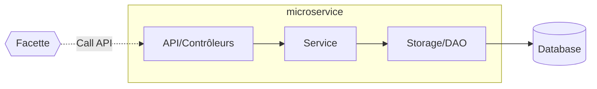

# Les Microservices RUDI

## Présentation générale

L'architecture de RUDI repose sur un ensemble de microservices spécialisés, chacun responsable d'une fonctionnalité métier spécifique. Cette approche modulaire permet une plus grande flexibilité, une maintenance simplifiée et une évolution indépendante de chaque composant.

## Liste des microservices

| Microservice | Responsabilités |
|--------------|-----------------|
| [ACL](microservice-acl.md) | Gestion des utilisateurs, authentification, autorisations |
| [APIGateway](microservice-apigateway.md) | Exposition des routes d'accès aux jeux de données |
| [Gateway](microservice-gateway.md) | Point d'entrée unique, routage, load balancing |
| [Kalim](microservice-kalim.md) | Intégration de données externes, moissonnage |
| [Konsent](microservice-konsent.md) | Gestion du consentement des utilisateurs |
| [Konsult](microservice-konsult.md) | Recherche et accès aux jeux de données, Eléments d'affichage pour la partie front |
| [KOS](microservice-kos.md) | Gestion des référentiels |
| [Projekt](microservice-projekt.md) | Suivi des projets de réutilisation de données |
| [Registry](microservice-registry.md) | Enregistrement des microservices |
| [Selfdata](microservice-selfdata.md) | Gestion des données personnelles |
| [Strukture](microservice-strukture.md) | Gestion des producteurs et fournisseurs de données, des organisations utilisatrices de RUDI |

Chaque microservice:
- Est autonome avec sa propre base de données
- Expose une API REST
- S'enregistre auprès du Service Registry
- Accède aux autres services à travers la Gateway
- Partage une facette (bibliothèque commune) avec les autres microservices
- Echange avec les autres microservices à l'aide de leur facette

## Structure commune des microservices

Chaque microservice RUDI suit une structure similaire comprenant généralement trois couches:

1. **La couche API (Facade)**: Expose les points d'entrée REST
2. **La couche Service**: Contient la logique métier
3. **La couche Storage/DAO**: Gère la persistance des données

L'ensemble est réparti dans 4 modules :

- **rudi-microservice-*-facade**: Points d'entrée REST et contrôleurs
- **rudi-microservice-*-service**: Logique métier et services
- **rudi-microservice-*-storage**: Persistence des données et DAO
- **rudi-microservice-*-core**: Modèles et objets partagés

Chaque microservice dispose d'une **facette** qui est une librairie exposant tout ou partie de son API, facilitant les appels par les autres microservices.

Chaque microservice dispose de son propre schéma dans la **base de données** PostgreSQL. 

Chaque microservice dispose de son propre utilisateur de base de données, avec accès uniquement à son propre schéma.

Les principes suivants sont appliqués:

- Pas de partage de données entre microservices
- Chaque service est responsable de sa propre persistance
- Les données partagées sont exposées via des APIs

