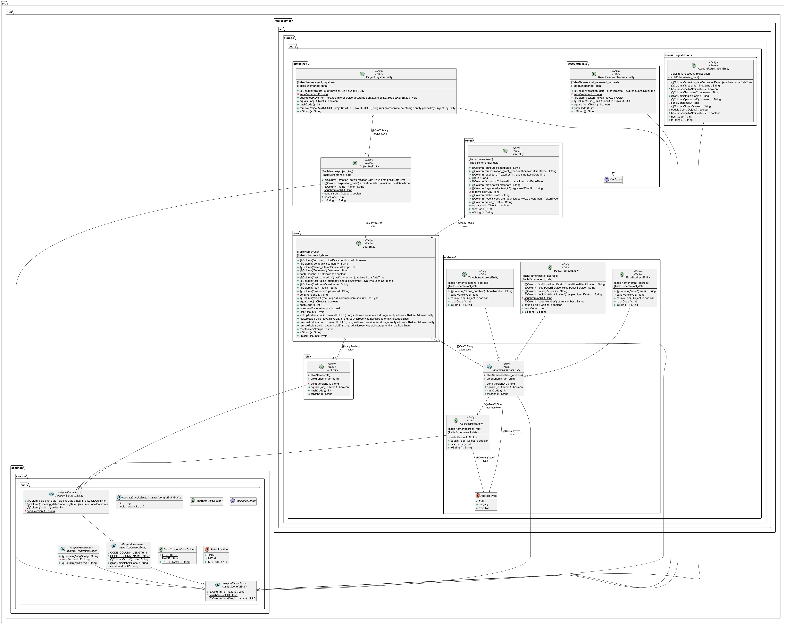

# Microservice ACL

## Présentation générale

Le microservice ACL (Access Control List) est responsable de l'authentification des utilisateurs et de la gestion des autorisations dans la plateforme RUDI. Il constitue un élément central du système de sécurité, permettant de contrôler l'accès aux différentes ressources de la plateforme.

- Authentification des utilisateurs (JWT et OAuth2) à l'aide de Spring Security
- Gestion des utilisateurs et de leurs rôles

## Architecture technique

Le microservice ACL suit l'architecture standard des microservices RUDI avec trois couches principales:


## Structure du code

Le microservice est organisé en plusieurs modules:

- **rudi-microservice-acl-facade**: Points d'entrée REST et contrôleurs
- **rudi-microservice-acl-service**: Logique métier et services
- **rudi-microservice-acl-storage**: Persistence des données et DAO
- **rudi-microservice-acl-core**: Modèles et objets partagés

## Authentification

Vous trouverez ci-dessous 2 exemples de récupération de token auprès du microservice ACL. [Voir plus d'exemples d'appels à l'API d'authentification.](../../../rudi-microservice/rudi-microservice-acl/README.md)


### Authentification JWT

```
POST /authenticate
```

Exemple de requête:
```shell
curl --url https://$host:$port/authenticate \
  --header 'accept: application/json' \
  --header 'authorization: Basic Abcdefghijk==' \
  --header 'content-type: application/x-www-form-urlencoded' \
  --data 'login='$login'' \
  --data 'password='$password''
```

Exemple de réponse:
```json
{
    "jwtToken": "Bearer eyJhbGciOiJIUzUxMiJ9...",
    "refreshToken": "Bearer eyJhbGciOiJIUzUxMiJ9..."
}
```

### Authentification OAuth2

```
POST /oauth2/token
```

Exemple de requête:

```shell
export basicauth=`echo -n "$login:$password" | base64 -w 0`

curl -kv --url https://$host:$port/oauth2/token \
  --header 'accept: application/json' \
  --header 'authorization: Basic '$basicauth'' \
  --header 'content-type: application/x-www-form-urlencoded' \
  --data 'username='$login'' \
  --data 'password='$password'' \
  --data 'grant_type=client_credentials'

```

Exemple de réponse:
```json
{
  "access_token": "eyJhbGciOiJIUzUxMiJ9...",
  "token_type": "Bearer",
  "expires_in": 299
}
```

## Rôles et autorisations des utilisateurs

Il existe plusieurs rôles pour les utilisateurs de RUDI. Ceux-ci sont insérés directement dans la base de données au démarrage du microservice ACL.

Un utilisateur peut avoir 1 ou plusieurs rôles.

| Rôle | Description |
|------|-------------|
| ADMINISTRATOR | Utilisateur administrateur du système |
| ANONYMOUS | Utilisé par défaut pour un utilisateur de l'IHM avant sa connexion |
| MODERATOR | Utilisateur animateur de la plateforme. Il valide certaines demandes des utilisateurs |
| USER | Utilisateur enregistré sur la plateforme |
| ORGANIZATION | Rôle obsolète |
| PROJECT_MANAGER | Rôle obsolète |
| PROVIDER | Fournisseur de données |
| MODULE | Rôle technique pour l'ensemble des microservices |
| MODULE_ACL | Rôle technique pour le microservice ACL |
| MODULE_ACL_ADMINISTRATOR | Rôle technique pour le microservice ACL, pour les opérations avancées |
| MODULE_APIGATEWAY_ADMINISTRATOR | Rôle technique pour le microservice APIGateway |
| MODULE_KALIM | Rôle technique pour le microservice Kalim |
| MODULE_KALIM_ADMINISTRATOR | Rôle technique pour le microservice Kalim, pour les opérations avancées |
| MODULE_KONSENT | Rôle technique pour le microservice Konsent |
| MODULE_KONSENT_ADMINISTRATOR | Rôle technique pour le microservice Konsent, pour les opérations avancées |
| MODULE_KONSULT | Rôle technique pour le microservice Konsult |
| MODULE_KONSULT_ADMINISTRATOR | Rôle technique pour le microservice Konsult, pour les opérations avancées |
| MODULE_KOS_ADMINISTRATOR | Rôle technique pour le microservice KOS |
| MODULE_PROJEKT | Rôle technique pour le microservice Projekt |
| MODULE_PROJEKT_ADMINISTRATOR | Rôle technique pour le microservice Projekt, pour les opérations avancées |
| MODULE_SELFDATA | Rôle technique pour le microservice Selfdata |
| MODULE_SELFDATA_ADMINISTRATOR | Rôle technique pour le microservice Selfdata, pour les opérations avancées |
| MODULE_STRUKTURE | Rôle technique pour le microservice Strukture |
| MODULE_STRUKTURE_ADMINISTRATOR | Rôle technique pour le microservice Strukture, pour les opérations avancées |

Les opérations sur les API sont autorisées en fonction du rôle de l'utilisateur grâce à l'utilisation de l'annotation `@PreAuth` de [**Spring Security**](https://docs.spring.io/spring-security/reference/servlet/authorization/method-security.html).

Par exemple, la méthode suivante du contrôleur `org.rudi.microservice.projekt.facade.controller.ProjectController` n'est disponible que pour un utilisateur ayant au moins l'un des rôles :
- `USER` (utilisateur standard connecté à son compte)
- `ADMINISTRATOR` (utilisateur administrateur de la plateforme)
- `MODULE_PROJEKT_ADMINISTRATOR` ou `MODULE_PROJEKT` (microservice Projekt)
- `PROJECT_MANAGER`

Les utilisateurs n'ayant aucun de ces rôles seront rejetés.

```java
	@Override
	@PreAuthorize("hasAnyRole(" + ADMINISTRATOR + ", " + MODULE_PROJEKT_ADMINISTRATOR + ", " + MODULE_PROJEKT + ", " + PROJECT_MANAGER + ", " + USER + ")")
	public ResponseEntity<Project> createProject(Project project) throws Exception {
    ...
  }
```


## Diagramme de classes



## Intégration avec les autres services

Le microservice ACL est utilisé par tous les autres microservices pour:

- Valider les tokens JWT
- Vérifier les autorisations
- Récupérer les informations utilisateur

Cette intégration se fait principalement via les facettes 
- `rudi-facet-acl` qui encapsule les appels à l'API ACL.
- `rudi-facet-oauth2` qui encapsule les appels d'authentification.

## Sécurité

Le microservice ACL implémente plusieurs mécanismes de sécurité:

- Chiffrement des mots de passe avec BCrypt
- Validation des tokens JWT avec signature
- Protection contre les attaques de force brute par l'[API Captchetat](https://www.data.gouv.fr/fr/dataservices/api-captchetat/)


## Configuration

### Exemple de configuration

Un exemple de fichier de configuration est disponible [ici](../../../rudi-microservice/rudi-microservice-acl/rudi-microservice-acl-facade/src/main/resources/acl-exemple.properties).
