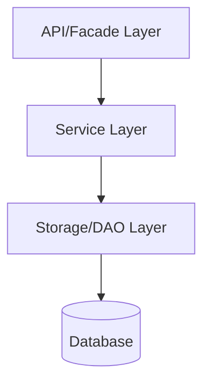

# Microservice Kalim

## Présentation générale

Le microservice Kalim permet la publication des jeux de données par les fournisseurs. Il sert d'interface pour l'ingestion et la validation des données dans l'écosystème RUDI.

- Publication des jeux de données par les fournisseurs
- Validation des formats et structures des données entrantes
- Traitement et transformation des métadonnées
- Intégration avec les autres microservices pour le stockage et la diffusion des données
- Suivi et journalisation des opérations de publication

## Architecture technique

Le microservice suit l'architecture standard des microservices RUDI avec trois couches principales:

## Structure du code

Le microservice est organisé en plusieurs modules:

- **rudi-microservice-kalim-facade**: Points d'entrée REST et contrôleurs
- **rudi-microservice-kalim-service**: Logique métier et services
- **rudi-microservice-kalim-storage**: Persistence des données et DAO
- **rudi-microservice-kalim-core**: Modèles et objets partagés

## Diagramme de classes

## Configuration

### Exemple de configuration

Un exemple de fichier de configuration est disponible [ici](../../../rudi-microservice/rudi-microservice-kalim/rudi-microservice-kalim-facade/src/main/resources/kalim-exemple.properties).
