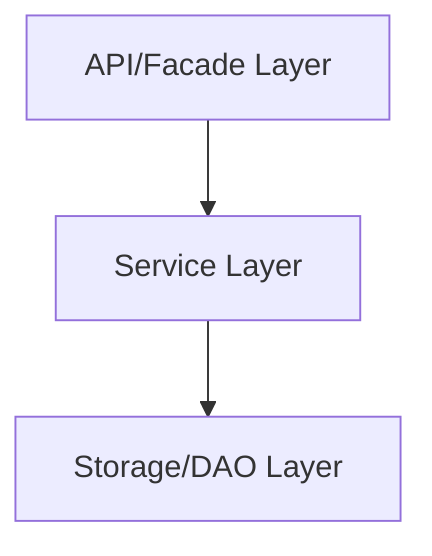

# Microservice Konsult

## Présentation générale

Le microservice Konsult est utilisé pour la recherche et accès aux jeux de données, ainsi que pour la fourniture d'éléments d'affichage pour la partie front.

## Architecture technique

Le microservice suit l'architecture standard des microservices RUDI avec trois couches principales:

## Structure du code

Le microservice est organisé en plusieurs modules:

- **rudi-microservice-konsult-facade**: Points d'entrée REST et contrôleurs
- **rudi-microservice-konsult-service**: Logique métier et services
- **rudi-microservice-konsult-core**: Modèles et objets partagés

## Configuration

### Exemple de configuration

Un exemple de fichier de configuration est disponible [ici](../../../rudi-microservice/rudi-microservice-konsult/rudi-microservice-konsult-facade/src/main/resources/konsult-exemple.properties).

