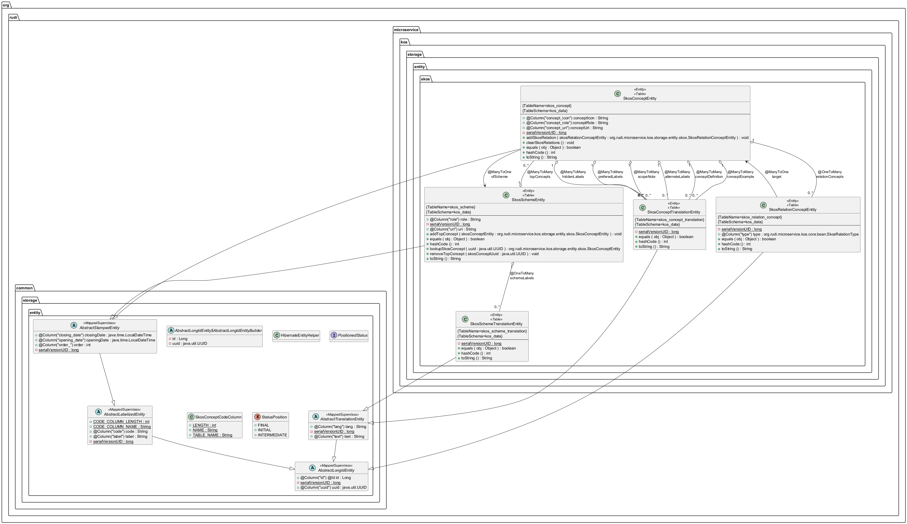

# Microservice Kos

## Présentation générale

Le microservice Kos est utilisé pour la gestion du référentiell SKOS (https://skos.um.es/) de RUDI et notamment des thématiques.

## Architecture technique

Le microservice suit l'architecture standard des microservices RUDI avec trois couches principales:

## Structure du code

Le microservice est organisé en plusieurs modules:

- **rudi-microservice-kos-facade**: Points d'entrée REST et contrôleurs
- **rudi-microservice-kos-service**: Logique métier et services
- **rudi-microservice-kos-storage**: Persistence des données et DAO
- **rudi-microservice-kos-core**: Modèles et objets partagés

## Diagramme de classes

## Configuration

### Exemple de configuration

Un exemple de fichier de configuration est disponible [ici](../../../rudi-microservice/rudi-microservice-kos/rudi-microservice-kos-facade/src/main/resources/kos-exemple.properties).

