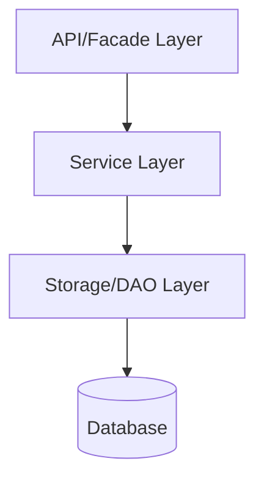
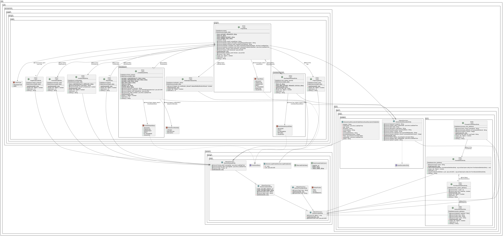

# Microservice Projekt

## Présentation générale

Le microservice Projekt est utilisé pour le suivi des projets de réutilisation de données.

## Architecture technique

Le microservice suit l'architecture standard des microservices RUDI avec trois couches principales:

## Structure du code

Le microservice est organisé en plusieurs modules:

- **rudi-microservice-projekt-facade**: Points d'entrée REST et contrôleurs
- **rudi-microservice-projekt-service**: Logique métier et services
- **rudi-microservice-projekt-storage**: Persistence des données et DAO
- **rudi-microservice-projekt-core**: Modèles et objets partagés

## Diagramme de classes

## Configuration

### Exemple de configuration

Un exemple de fichier de configuration est disponible [ici](../../../rudi-microservice/rudi-microservice-projekt/rudi-microservice-projekt-facade/src/main/resources/projekt-exemple.properties).

