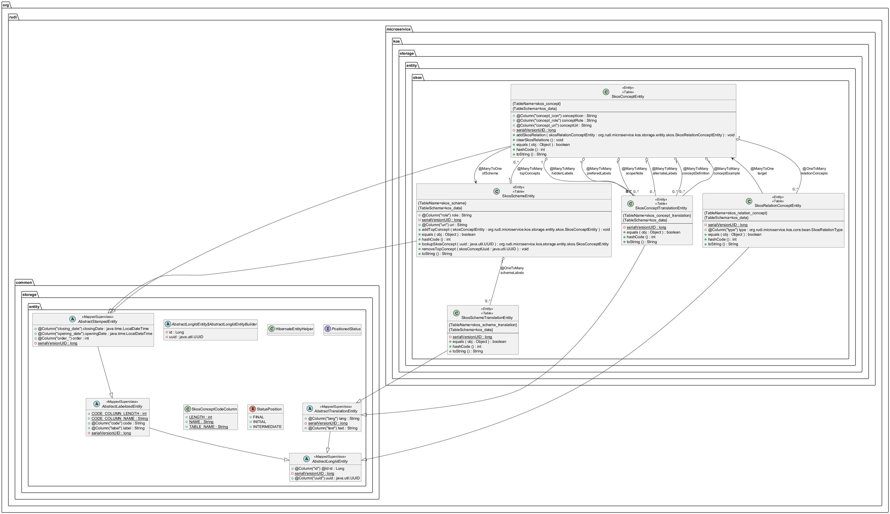

# Rudi - µService Kos

Le µService Kos permet d'accéder aux Thématiques et la leurs dérivées selon un modèle SKOS (https://fr.wikipedia.org/wiki/Simple_Knowledge_Organization_System).

## Diagramme de classes

