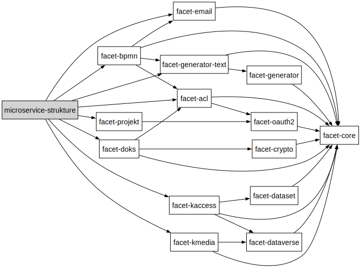

# Rudi - µService Strukture

Le µService Strukture permet la gestion des fournisseurs, des noeuds fournisseurs et des organizations.

## Diagramme de classes


## Dépendances vers les facets



## Extensions nécessaire en base de donnée.

Pour le bon fonctionnement de l'application la base de donnée postgresql doit posséder ces extension :

```postgresql
CREATE EXTENSION IF NOT EXISTS postgis;
CREATE EXTENSION IF NOT EXISTS fuzzystrmatch;
CREATE EXTENSION IF NOT EXISTS "uuid-ossp";
CREATE EXTENSION IF NOT EXISTS postgis_topology;
CREATE EXTENSION IF NOT EXISTS postgis_tiger_geocoder;
CREATE EXTENSION IF NOT EXISTS unaccent;
```